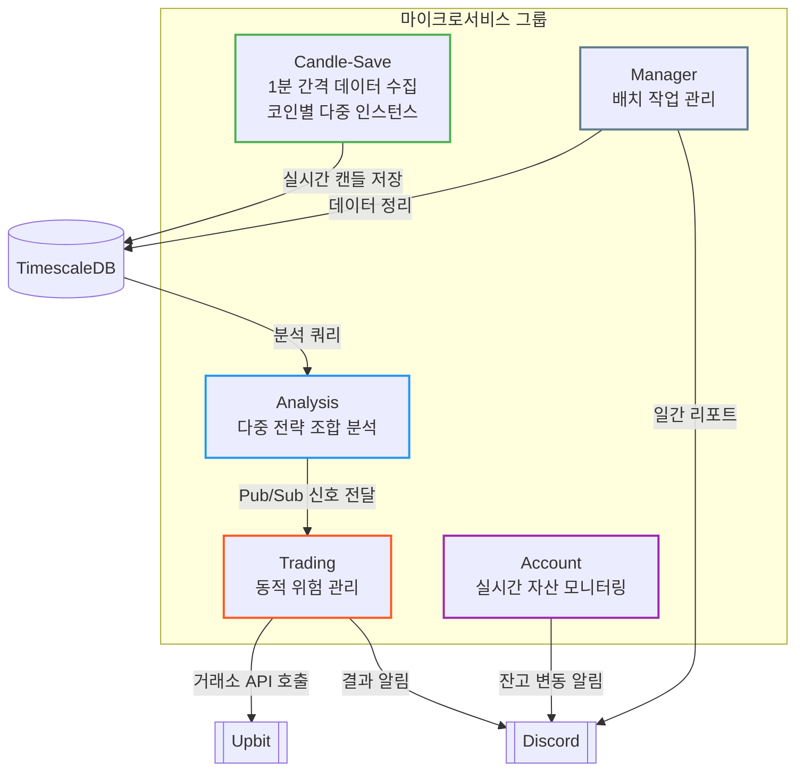
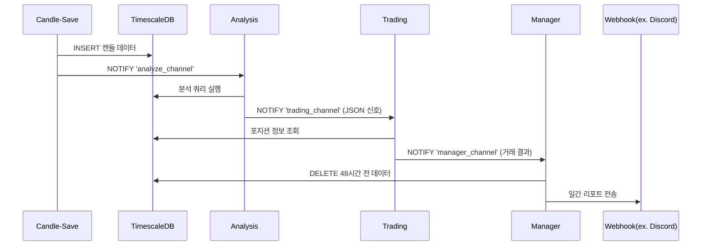
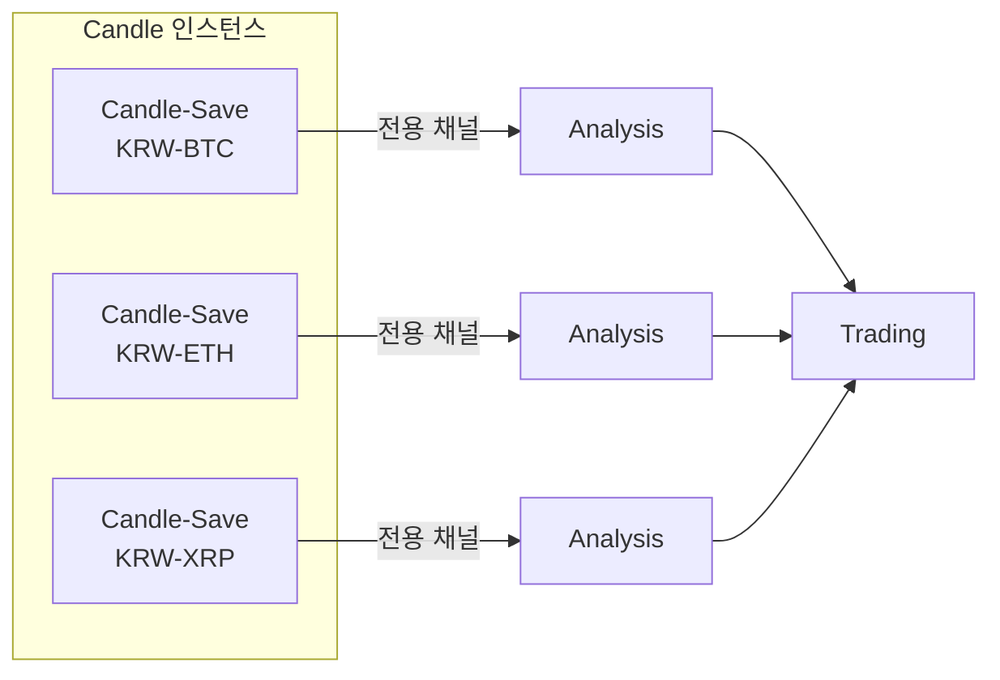

# Money - 암호화폐 자동 거래 시스템


거래소 API 기반의 암호화폐 자동 거래 시스템. 실시간 데이터 수집, 다중 전략 분석, 자동 매매 실행을 위한 마이크로서비스 아키텍처를 제공합니다.

## 🛠 기술 스택
- **언어 + 런타임**: TypeScript + Bun v1.1.42
- **데이터베이스**: TimescaleDB (PostgreSQL 확장)
- **프로세스 관리**: PM2
- **주요 라이브러리**: node-cron
- **테스팅 라이브러리**: testcontainers


## 🚀 시작하기
- Bun 1.1.42+
- TimescaleDB 2.12.0+pg13
- PM2 (글로벌 설치)

```bash
# 저장소 복제
git clone [repository-url]
cd money

# 의존성 설치
bun install

# 환경 설정(example 파일 참고하여 환경변수 설정)
cp .env.example .env

# 도커 빌드 및 실행
docker-compose up --build

# 백그라운드 실행 시
docker-compose up -d --build
```

### 서비스 실행
```bash
# 개발 모드(timescaledb 데이터베이스 로컬 기동 필요)
bun run start:test
```

## 🏗 시스템 아키텍처





### 마이크로서비스 구성
1. **Candle-Save 서비스**
   - 분 단위(1분봉) 데이터 수집
   - 코인별 독립 인스턴스 운영 (환경변수 CRYPTO_CODE로 구분)
     - 예시: `CRYPTO_CODE=KRW-BTC`
     - 시스템 환경변수 설정 필요(ecosystem.config.js)
     - 코인별 인스턴스 운용 시 TIME 환경변수 설정을 통한 초 주기 설정 필요
   - 주요 Pub/Sub 이벤트: 
     - `analyze_channel`: 분석 서비스 트리거

2. **Analysis 서비스**
   - 전략 팩토리 패턴 기반 다중 분석
   - 다중 전략 조합 점수 산출
   - 환경변수 `STRATEGIES`로 전략 리스트 설경
     - 예시: `STRATEGIES=RSI,MA,Volume`
   - 추가 전략이 필요할 경우 IStrategy 인터페이스를 구현하여 추가
     - factory 패턴 사용으로 전략 추가 가능
   - `trading_channel`로 JSON 포맷 신호 전송

3. **Trading 서비스**
   - 동적 임계값 계산 (시장 추세 반영)
   - 비선형 가중치 매매 알고리즘
   - 손절/익절 매커니즘 구현
     - STOP_LOSS_THRESHOLD, PROFIT_TAKE_THRESHOLD 환경변수 설정 필요

4. **Manager 서비스**
   - 일간 데이터 집계(00:00 KST)
   - 48시간 전 데이터 자동 삭제
   - 웹훅 통신 구현

## 🤝 기여 가이드
1. 저장소 Fork
2. 기능 브랜치 생성 (`feature/your-feature`)
3. 커밋 후 Push
4. Pull Request 생성

## 📄 라이선스
MIT License
