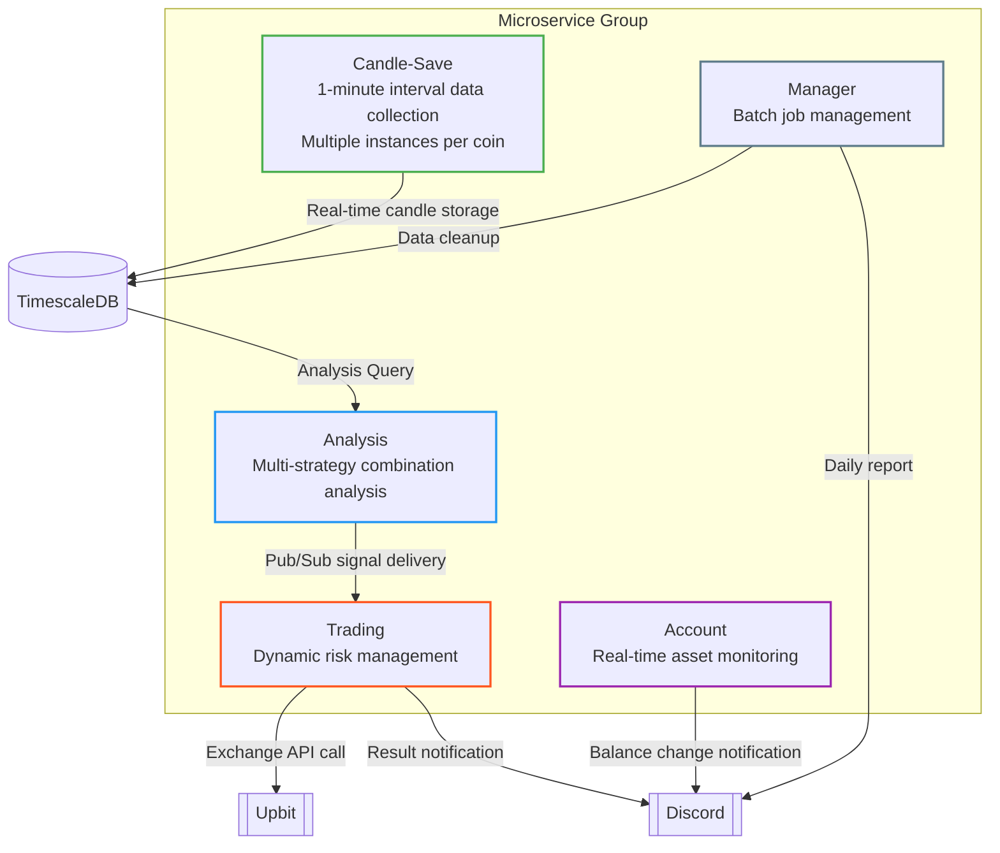
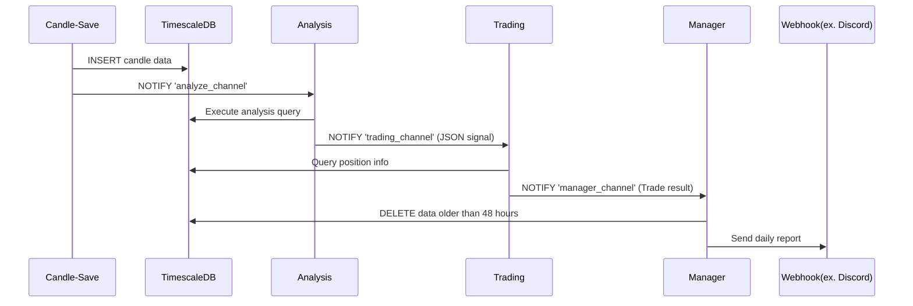
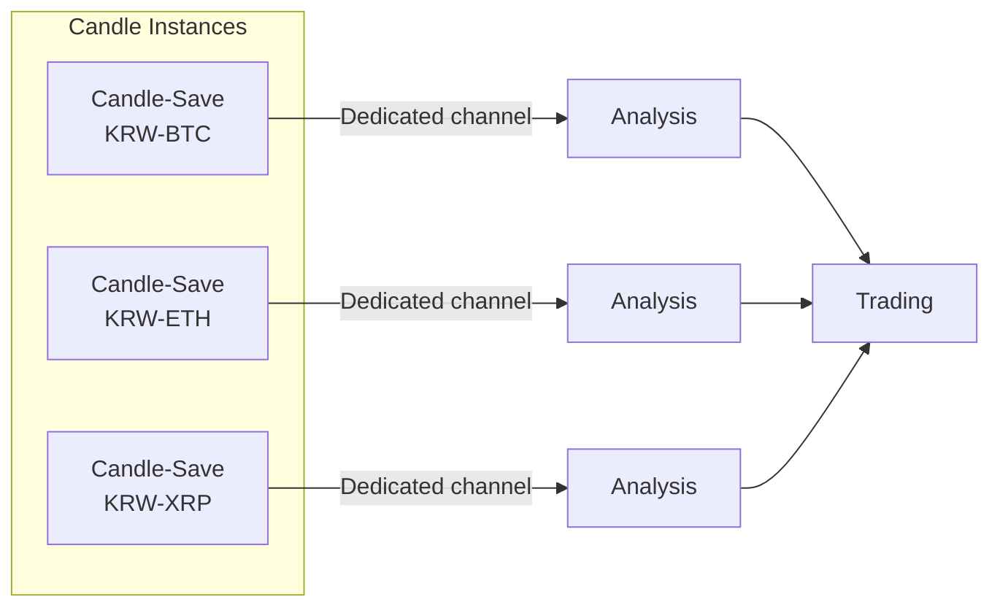

# CryptoZzz - Cryptocurrency Automatic Trading System


[한국어로된 문서 보기](https://github.com/limcpf/CryptoZzz/blob/main/README.ko.md)

A cryptocurrency automatic trading system based on exchange APIs. Provides microservice architecture for real-time data collection, multi-strategy analysis, and automated trading execution.

## 🛠 Tech Stack
- **Language + Runtime**: TypeScript + Bun v1.1.42
- **Database**: TimescaleDB (PostgreSQL extension)
- **Process Management**: PM2
- **Main Libraries**: node-cron
- **Testing Libraries**: testcontainers

## 🚀 Getting Started
- Bun 1.1.42+
- TimescaleDB 2.12.0+pg13
- PM2 (Global installation)

```bash
# Clone repository
git clone [repository-url]
cd money

# Install dependencies
bun install

# Configure environment (refer to example file for environment variables)
cp .env.example .env

# Docker build and run
docker-compose up --build

# Run in background
docker-compose up -d --build
```

### Run Services
```bash
# Development mode (requires local TimescaleDB database)
bun run start:test
```

## 🏗 System Architecture






### Microservice Configuration
1. **Candle-Save Service**
   - Minute-level (1-minute candle) data collection
   - Independent instance operation per coin (distinguished by CRYPTO_CODE)
     - Example: `CRYPTO_CODE=KRW-BTC`
     - System environment variables required (ecosystem.config.js)
     - Second interval setting through TIME environment variable required for per-coin instances
   - Main Pub/Sub events:
     - `analyze_channel`: Analysis service trigger

2. **Analysis Service**
   - Multi-analysis based on strategy factory pattern
   - Multi-strategy combination score calculation
   - Strategy list configuration via `STRATEGIES` environment variable
     - Example: `STRATEGIES=RSI,MA,Volume`
   - Additional strategies can be implemented using IStrategy interface
     - New strategies can be added using factory pattern
   - JSON format signal transmission via `trading_channel`

3. **Trading Service**
   - Dynamic threshold calculation (reflecting market trends)
   - Non-linear weighted trading algorithm
   - Stop-loss/Take-profit mechanism implementation
     - STOP_LOSS_THRESHOLD, PROFIT_TAKE_THRESHOLD environment variables required

4. **Manager Service**
   - Daily data aggregation (00:00 KST)
   - Automatic deletion of 48-hour old data
   - Webhook communication implementation

## 🤝 Contribution Guide
1. Fork repository
2. Create feature branch (`feature/your-feature`)
3. Commit and Push
4. Create Pull Request

## 📄 License
MIT License
